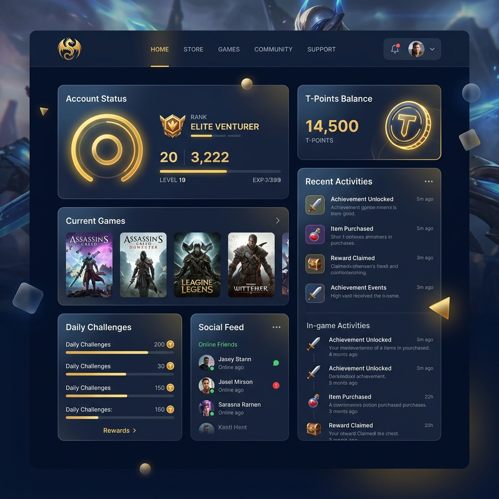
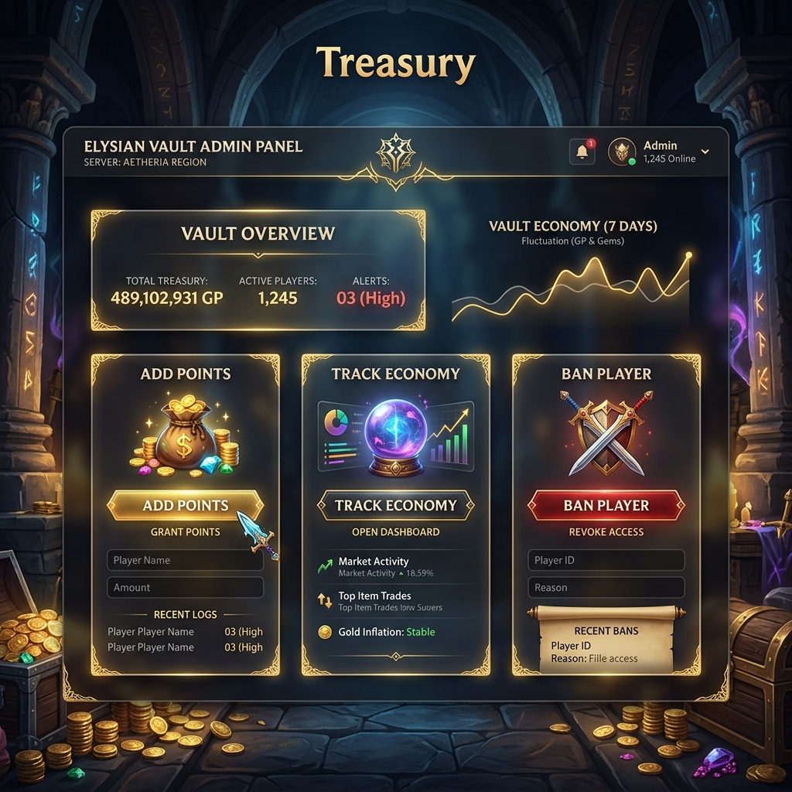

# ⚔️ Talisman Online: Ultimate Management Engine ⚔️

Welcome, Adventurer! You have just discovered the most powerful **Management Engine** ever forged for Talisman Online servers. Stop living in the "Dark Ages" of database editing and **Level Up** your server management experience.

---

## 🛑 Stop the phpMyAdmin Headache!

Are you still manually opening **phpMyAdmin**, searching for a player's account, and carefully typing numbers into the `gd` column just to send coins? 

**That is the old way. It is slow, risky, and a massive headache.**

### 💎 The Modern Way: One-Click Treasury Control
With this Ultimate Management Engine, you never have to touch a database table again for daily tasks. 
- **No More Manual GD Edits:** Use the **Vault Interface** to add T-Points or eCoins instantly.
- **Bulk Rewards:** Want to give points to everyone online? Do it in one click.
- **History Tracking:** Every point sent is logged. No more wondering "Did I send those coins?"
- **Safety First:** No risk of accidentally deleting a row or breaking a table structure.

---

## 🌟 Epic Features

### 🏰 The Royal Dashboard
A stunning **Glassmorphic** interface for your players. It looks like a premium AAA game portal, not a boring 2005 website.
- **Live Stats:** Players can see their level, coins, and security status at a glance.
- **Security Guard:** Integrated **Google Authenticator (2FA)**. Hackers won't stand a chance.

### 💰 The Global Exchange
Whether your community calls them **T-Points** or **eCoins**, you can switch the entire website's branding in **one click**.
- **Dynamic Branding:** Use the built-in presets to instantly change all labels, buttons, and messages across the entire site.

### 🛡️ Administrative Vault (Staff Only)

- **Economy Analytics:** See who the "Whales" are. Track the wealthiest players instantly.
- **Donation Command Center:** Process PayPal and GCash donations with zero effort.
- **Character Control:** Manage players, check logs, and maintain order without leaving the dashboard.

---

## 🌐 Choose Your Language / Pumili ng Wika / Elige tu Idioma

- [English](#english) | [Tagalog](#tagalog) | [Spanish](#spanish)

---

### 🇺🇸 English: How to Deploy
1. **Upload:** Drop these files onto your web server.
2. **Connect:** Setup your database in `include/db_config.php`.
3. **Ascend:** Contact **DarkScorpion** to activate your domain and start your journey!

---

### 🇵🇭 Tagalog: Paano I-set up
1. **Upload:** Ilagay ang mga files sa iyong web server.
2. **Connect:** I-setup ang database sa `include/db_config.php`.
3. **Ascend:** Mag-message kay **DarkScorpion** para i-whitelist ang iyong domain at magsimula!

---

### 🇪🇸 Spanish: Cómo desplegar
1. **Subir:** Coloque estos archivos en su servidor web.
2. **Conectar:** Configure su base de datos en `include/db_config.php`.
3. **Ascender:** ¡Contacta a **DarkScorpion** para activar tu dominio y comenzar tu viaje!

---

## 👨‍💻 Created By: DarkScorpion

Level up your server's professional look today. For payments, activation, and whitelisting:

- **Facebook:** [fb.me/darkscorpiont](http://fb.me/darkscorpiont)
- **Developer:** DarkScorpion

> [!IMPORTANT]
> **Domain Whitelisting Required:** This engine is protected and requires an authorized domain. Contact DarkScorpion on Facebook to register.

---

*Forged with ❤️ for the Talisman Community by DarkScorpion.*
