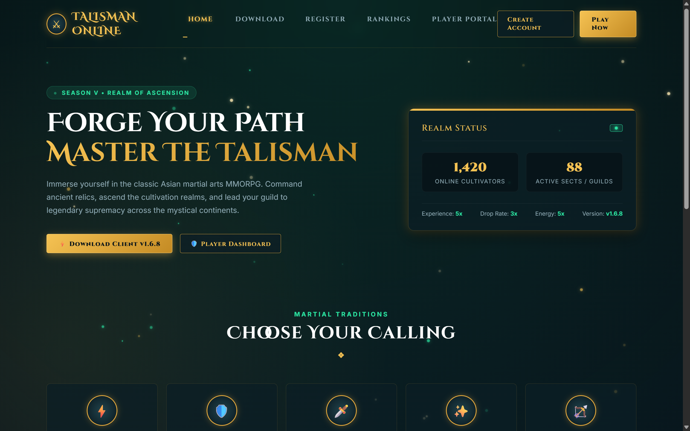

# 🐉 Talisman Online: Celestial Wuxia Edition (Theme 1)

An authentic Eastern Xianxia & Wuxia martial arts theme tailored specifically for **Talisman Online**. Designed with deep midnight teal/jade tones, brushed imperial gold borders, and drifting chi particles.

---

## 📸 Live Visual Preview

---

## 🌟 Theme Highlights

- **Aesthetic**: Deep Midnight Jade (`#050d12`), Imperial Gold (`#f5c253`), and Ethereal Jade glows.
- **Typography**: Google Fonts `Cinzel Decorative` (Oriental fantasy headers) + `Inter` (crisp UI body).
- **Dynamic FX**: Native HTML5 Canvas chi/ember particle engine with smooth floating animations.
- **Key Features**:
  - Live Server Status Monolith (Online cultivators, active sects, custom server rates).
  - 5 Martial Arts Classes showcase (Wizard, Monk, Assassin, Fairy, Tamer).
  - Realtime Top Cultivators Leaderboard & Realm Proclamations.
  - Dedicated Player Portal (`dashboard.php`) with eCoins balance, character switcher, and VIP tracking.

---

## 🛠️ Included Pages

| Page | File | Description |
| :--- | :--- | :--- |
| **Portal / Home** | `index.php` / `index.html` | Hero header, class preview, live server rates & news proclamations. |
| **Player Dashboard** | `dashboard.php` | Account management, eCoin recharge, character switcher & Google 2FA. |
| **Style System** | `css/style.css` | Modular CSS tokens, glassmorphic card utilities, and responsive breakpoints. |
| **Interactive Engine** | `js/theme.js` | Floating particle physics and animated metric counters. |

---

## 🔌 Backend Integration
This theme connects directly to the decoded unencrypted backend:
- `include/config.php` & `include/db_config.php`
- `Functions/Database.php`
- `Functions/Accounts-Characters.php`
- `Functions/Shop.php`
