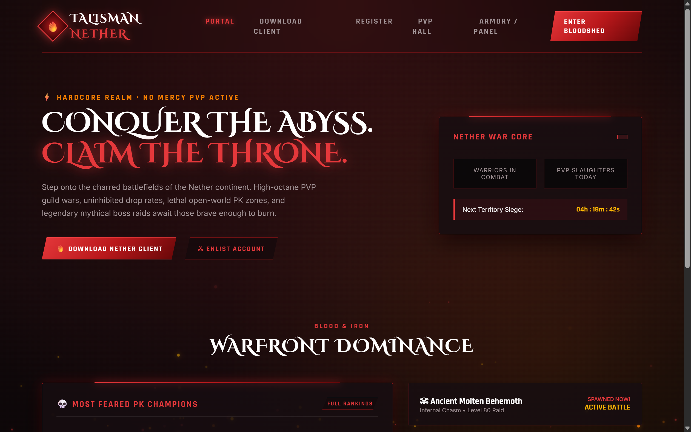

# 🔥 Talisman Online: Infernal Nether Edition (Theme 2)

An aggressive, high-octane dark fantasy and hardcore PVP theme for **Talisman Online**. Built with volcanic obsidian textures, molten lava glows, drifting ember particle effects, and razor-sharp angular UI framing.

---

## 📸 Live Visual Preview

---

## 🌟 Theme Highlights

- **Aesthetic**: Charred Obsidian (`#080607`), Molten Flame (`#e5383b`), Hellfire Orange (`#f77f00`), and Blood Ruby.
- **Typography**: Google Fonts `Cinzel Decorative` + `Rajdhani` (bold, angular, competitive).
- **Dynamic FX**: Rising lava embers canvas animation with physics and randomized flicker.
- **Key Features**:
  - Nether War Core telemetry widget with live PK slaughter counter and territory siege countdown.
  - World Boss Spawn Radar with live battle alerts.
  - Most Feared PK Champions leaderboard.
  - Aggressive cut-corner buttons with hover blaze animations.

---

## 🛠️ Included Pages

| Page | File | Description |
| :--- | :--- | :--- |
| **Portal / Warfront** | `index.php` / `index.html` | Hardcore PVP hero, boss spawn radar & PK leaderboard. |
| **Style System** | `css/style.css` | Angular clip-path utilities, flame gradients, and dark obsidian surfaces. |
| **Interactive Engine** | `js/theme.js` | Rising ember canvas simulation and countdown timers. |

---

## 🔌 Backend Integration
This theme connects directly to the decoded unencrypted backend:
- `include/config.php` & `include/db_config.php`
- `Functions/Database.php`
- `Functions/Accounts-Characters.php`
- `Functions/Server.php`
