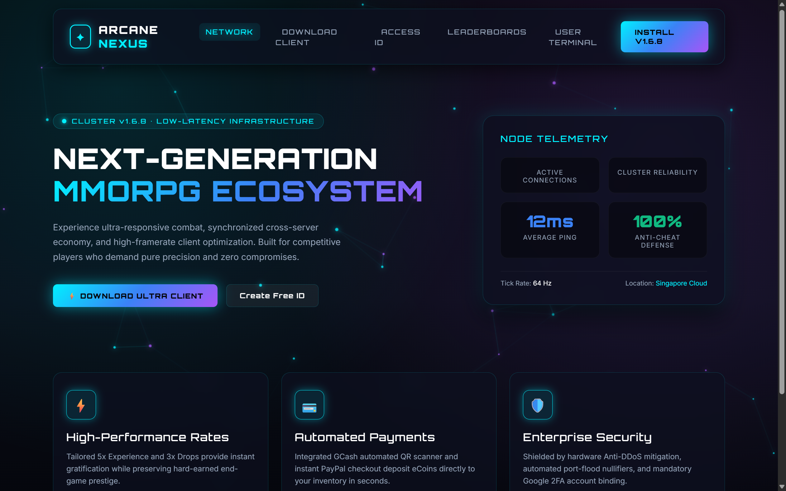

# 🔮 Talisman Online: Arcane Nexus Edition (Theme 3)

An ultra-modern, high-tech glassmorphic MMORPG private server portal. Designed with deep smoked obsidian glass (`backdrop-filter: blur(20px)`), electric cyan glows, ultraviolet energy accents, and a live connected constellation energy grid.

---

## 📸 Live Visual Preview

---

## 🌟 Theme Highlights

- **Aesthetic**: Deep Obsidian (`#05060b`), Electric Cyan (`#00f0ff`), Ultraviolet Neon (`#a855f7`), and smoked glass.
- **Typography**: Google Fonts `Orbitron` (high-tech display) + `Inter` (high-clarity UI).
- **Dynamic FX**: Interactive constellation node network on HTML5 canvas with real-time particle distance rendering.
- **Key Features**:
  - Live Node Telemetry HUD (Active connections, ping, anti-cheat defense, cluster reliability).
  - Glassmorphic floating header with glowing action buttons.
  - High-performance feature cards with neon hover halos.
  - Built for competitive private server speed and modern gaming communities.

---

## 🛠️ Included Pages

| Page | File | Description |
| :--- | :--- | :--- |
| **Portal / Home** | `index.php` / `index.html` | High-tech hero, node telemetry widget, infrastructure rates & downloads. |
| **Style System** | `css/style.css` | Glassmorphic blur utilities, neon gradients, and responsive breakpoints. |
| **Interactive Engine** | `js/theme.js` | Interactive constellation energy grid canvas. |

---

## 🔌 Backend Integration
This theme connects directly to the decoded unencrypted backend:
- `include/config.php` & `include/db_config.php`
- `Functions/Database.php`
- `api/client_api.php`
- `api/admin_api.php`
