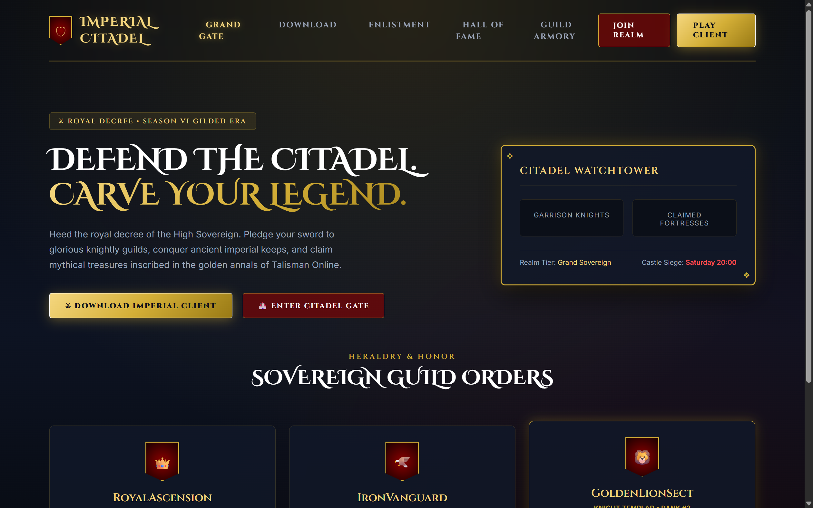

# 🏰 Talisman Online: Imperial Citadel Edition (Theme 4)

A grand royal fantasy and chivalric guild order theme for **Talisman Online**. Designed with rich royal navy velvet surfaces, heavy gilded gold filigree borders, heraldic guild banners, and castle siege watchtowers.

---

## 📸 Live Visual Preview

---

## 🌟 Theme Highlights

- **Aesthetic**: Deep Royal Navy (`#080b12`), Gilded Royal Gold (`#d4af37`), and Royal Velvet Crimson (`#8b0000`).
- **Typography**: Google Fonts `Cinzel Decorative` + `Cinzel` (regal, timeless heraldry).
- **Heraldic UI**: Custom shield crests, castle watchtower telemetry, and royal decree badge ribbons.
- **Key Features**:
  - Citadel Watchtower widget tracking garrison knights, claimed fortresses, and weekly castle siege schedules.
  - Sovereign Guild Orders Hall of Fame with guild coats of arms.
  - Gilded gold call-to-action buttons with shimmering hover illumination.
  - Dedicated to server prestige, guild glory, and castle conquest.

---

## 🛠️ Included Pages

| Page | File | Description |
| :--- | :--- | :--- |
| **Portal / Grand Gate** | `index.php` / `index.html` | Royal decree hero, watchtower widget, guild orders & client downloads. |
| **Style System** | `css/style.css` | Gilded border tokens, royal velvet cards, and responsive layouts. |

---

## 🔌 Backend Integration
This theme connects directly to the decoded unencrypted backend:
- `include/config.php` & `include/db_config.php`
- `Functions/Database.php`
- `Functions/Accounts-Characters.php`
- `Functions/Shop.php`
